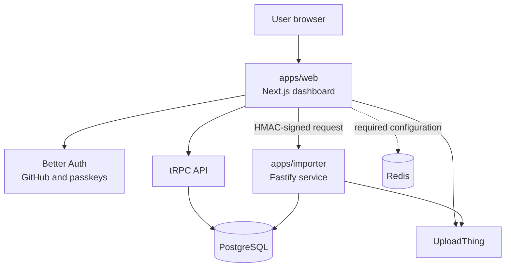

# Startime

Startime is a developer-activity dashboard. It imports coding activity data, stores it in PostgreSQL, and presents time, streak, and usage breakdowns in a web dashboard.

[Icon Pack](https://github.com/material-extensions/vscode-material-icon-theme)

## Features

- GitHub sign-in with Better Auth and passkey support.
- Personal activity dashboard with total time, today's time, current streak, and longest streak.
- Activity breakdowns by editor, workspace, language, and platform, with date-range filtering.
- Organization creation, membership roles, and invitations.
- CodeTime CSV imports up to 64 MB, with background processing and progress reporting.
- Privacy-preserving file identifiers: imported file paths are HMAC-hashed before they are stored.
- User data exports as downloadable ZIP archives.

## Contributing

See [CONTRIBUTING.md](./CONTRIBUTING.md) for local setup, development and
extension guidelines, validation commands, and pull-request expectations.

Also join our [Discord](https://starlightv.link/discord) community if you have questions or want to contribute.

## Architecture

### Activity import flow

1. An authenticated user uploads a CodeTime CSV through the web application.
2. UploadThing stores the private file; the web app creates an `eventImports` record in PostgreSQL.
3. The web app submits a signed `POST /v1/imports` request to the importer.
4. The importer verifies the signature, downloads the file using a temporary UploadThing URL, validates and parses the CSV, then inserts activity events in batches of 500.
5. Import progress is written to PostgreSQL and polled by the web UI. When processing ends, the importer deletes the uploaded source file.

### Data model

The shared schema stores users, auth accounts and sessions, passkeys, organizations and memberships, activity events, uploaded files, import jobs, and export jobs. All Startime tables use the `startime_` prefix to avoid collisions with existing database tables.

## Planned Extensions

|     Name      | Description                    | Status |
| :-----------: | ------------------------------ | :----: |
|      zed      |                                |   ✅   |
|   obsidian    | For tracking your time writing |   ⌛   |
|     unity     | The Game development engine    |   ⌛   |
|    vscode     | The most popular editor        |   ❌   |
| visual-studio |                                |   ❌   |
|    cursor     |                                |   ❌   |
|      vim      |                                |   ❌   |
|    neovim     |                                |   ❌   |
| intellij-idea |                                |   ❌   |
